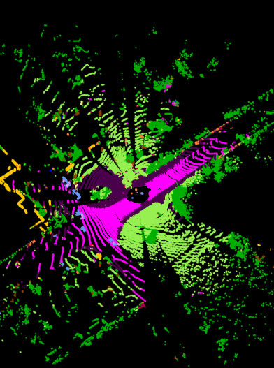

polarseg-kitti
==============================

This repository contains a PyTorch Lightning re-implementation of the PolarNet architecture ([arxiv](https://arxiv.org/abs/2003.14032)), published by Zhang et al. It is a Development Track term project for the CS492 course at KAIST.


## Initial steps

Start by autoatcially generating an environment for *conda* or *venv* with the following command in the top directory:
```shell
$ make create_environment
``` 
After activating this environment, install the requirements:
```shell
$ make requirements
```
Finally, initialize the [pre-commit](https://pre-commit.com/) git hooks:
```shell
$ make lint
```

## Logging

Logging is done through the [Weights & Biases](https://wandb.ai/) for which, more detailed documentation can be found [here](https://docs.wandb.ai/).

After creating an account, for automatic log-in, copy your API key to the `.env` file in the root folder. If you do NOT want to log the experiment, set `wandb:False` in `config/{your_config}.yaml`.

`WANDB_API_KEY = $YOUR_API_KEY `

> Note: You might need to create the project yourself.

## Commands

### Configuration file

The definition of parameters and identification of IO-s are initialized in a single config file in `config/`. The example configuration is shown in `debug.yaml`, which is default loaded, when calling the following functions. In order to changes details of your training, it is recommended to make a copy of this file and rename it.

> Note: It is not recommended to modify the parameters between training and inference, as the configuration file is shared, hence it might result in mismatching networks (with special attention to the `backbone` and `projection_method`)!

### Training the model

```shell
python src/models/train_model.py --config <your_config.yaml>
```

### Testing the model

For testing the model, you should pass the configuration file that it has been created with. The script runs inference with the loaded model on the validatio set and saves the results into a `<model_name>.txt` file. Then runs inference with the loaded model on the test set and saved the resulting labels to `models/inference/<mode_name>/`. Fninally, it remaps the saved labels, zip and validate them for submission to the [SemanticKITTI Competition](https://competitions.codalab.org/competitions/20331). Optional flags (`--no-validate, --no-test, --no-prep`) allows for not executing specific blocks.

```shell
python src/models/predict_model.py --config <your_config.yaml> 
```

## Project Organization
------------

    ├── LICENSE
    ├── Makefile           <- Makefile for installing the environment.
    ├── README.md          <- The top-level README for general overview.
    ├── config             <- Configuration files for training, dataloaders and inference
    ├── data
    │   ├── debug          <- Small amount of data separated for debugging purposes.
    |   └── sequences      <- Read more about the data setup in the other README.
    |       └── 00/           
    |           ├── velodyne/
    |           └── labels/
    │
    ├── models             <- Trained and serialized models, model predictions, or model summaries
    │   ├── <modelname>.pt <- Saved model state-dict instance on best validation mIoU.
    |   └── inference      <- Test output from inferencing trained model.
    |       └── <model name>
    |           └── sequences
    |               ├── 00/
    |               └── predictions/
    │
    ├── references         <- Data dictionary for SemanticKITTI dataset and helper functions from 
    |                         [https://github.com/PRBonn/semantic-kitti-api]
    │
    ├── reports            <- Generated analysis as PDF, LaTeX, etc.
    │   └── figures        <- Generated graphics and figures to be used in reporting
    │
    ├── requirements.txt   <- The requirements file for reproducing the analysis environment, e.g.
    │                         generated with `pip freeze > requirements.txt`
    ├── .pre-commit-config.yaml <- pre-commit hooks, can be set up by <make lint>
    │
    └── src                <- Source code for use in this project.
        ├── data           <- Scripts for loading SemKITTI dataset and voxelisation.
        ├── features       <- Models, losses and feature generation pipeline.
        ├── misc           <- General function definitions
        └── models         <- Scripts to train models and then use trained models to make
            │                 predictions
            ├── predict_model.py
            └── train_model.py

--------

## Projection examples

> Note: label colors are just visualization, just similar, but not accurate to the [semantic-kitti-api](https://github.com/PRBonn/semantic-kitti-api) defined ones.

The black marks indicate the voxel origins for limited volume space and the gray dots are unlabbeled. On these examples, 10x more spares grid cells are used for better visualization $[48,36]$.

<p float="left">
  
   
</p>


## Experimental results

> Note: *Paper* refers to the test results of the original paper from Zhang et al.


>Note: The following figures is created based on results from the `evaluate_semantics_by_distance.py` and `visualize_voxels.py` from [semantic-kitti-api](https://github.com/PRBonn/semantic-kitti-api).


<p float="left">
  
   
</p>

reports/figures/visualize_polar_projection.png


## Reference list

The following is a reference list for functions used or inspired by other repositories.

 - `ignore_class, remap labels` <- based on documentation of [semantic-kitti-api](https://github.com/PRBonn/semantic-kitti-api)
 - `remap_semantic_labels.py, validate_submission.py, semantic-kitti.yaml` <- copied from [semantic-kitti-api](https://github.com/PRBonn/semantic-kitti-api)
 - `lovasz_losses.py` <- copied from [Bernman Maxim: LovaszSoftmax](https://github.com/bermanmaxim/LovaszSoftmax)
 - `grp_range_torch, polar_CBR.forward, label_voting, residual_distances` <- copied from [PolarSeg](https://github.com/edwardzhou130/PolarSeg)

Citation for the original paper:

```shell
@InProceedings{Zhang_2020_CVPR,
author = {Zhang, Yang and Zhou, Zixiang and David, Philip and Yue, Xiangyu and Xi, Zerong and Gong, Boqing and Foroosh, Hassan},
title = {PolarNet: An Improved Grid Representation for Online LiDAR Point Clouds Semantic Segmentation},
booktitle = {Proceedings of the IEEE/CVF Conference on Computer Vision and Pattern Recognition (CVPR)},
month = {June},
year = {2020}
}
```

<p><small>Project based on the <a target="_blank" href="https://drivendata.github.io/cookiecutter-data-science/">cookiecutter data science project template</a>. #cookiecutterdatascience</small></p>
